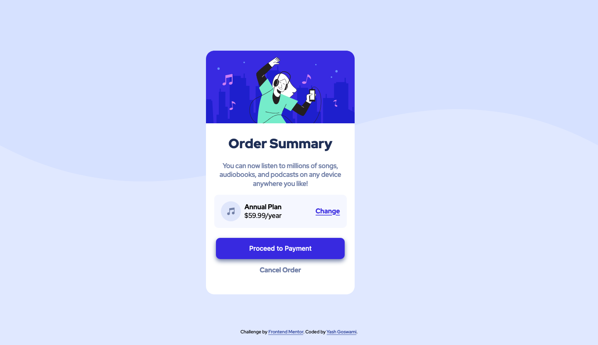

# Frontend Mentor - Order summary card solution

This is a solution to the [Order summary card challenge on Frontend Mentor](https://www.frontendmentor.io/challenges/order-summary-component-QlPmajDUj). Frontend Mentor challenges help you improve your coding skills by building realistic projects.

## Table of contents

- [Overview](#overview)
  - [The challenge](#the-challenge)
  - [Screenshot](#screenshot)
  - [Links](#links)
- [My process](#my-process)
  - [Built with](#built-with)
  - [What I learned](#what-i-learned)
  - [Continued development](#continued-development)
  - [Useful resources](#useful-resources)
- [Author](#author)
- [Acknowledgments](#acknowledgments)

## Overview

### The challenge

Users should be able to:

- See hover states for interactive elements

### Screenshot



### Links

- Solution URL: [Github Repo](https://github.com/Yash-devasp/order-summary-component)
- Live Site URL: [Live Site](https://yash-devasp.github.io/order-summary-component/)

## My process

### Built with

- Semantic HTML5 markup
- CSS custom properties
- Flexbox
- CSS Grid
- desktop-first workflow
- Firefox Developer Edition

### What I learned

In this challenge I came across different properties to apply a background image in the body. I have been learning CSS Grid and this is the first challenge in which I have applied it to create a small tag.

I have been working on how to structure code in a particular way and this is a great imporvement for me since my last challenges. Also the CSS is my first use of grids so I am happy to share it here .See below:

```html
<div class="order-details">
          
          <div class="order-detail-tag">
            <h2 class="order-detail-title">Annual Plan</h2>
            <p class="order-detail-price">$59.99/year</p>
          </div>
          <a href="#" class="order-detail-change">Change</a>
        </div>
        <button class="order-confirm">Proceed to Payment</button>
        <a href="#" class="order-cancel">Cancel Order</a>
      </div>
```

```css
.order-details {
  width: 80%;
  background-color: hsl(225, 100%, 98%);
  display: grid;
  grid-template-columns: 1fr 3fr 1fr;
  align-items: center;
  margin: auto;
  padding: 1rem;
  margin-bottom: 1.5rem;
  border-radius: 10px;
}
```

### Continued development

Now, I will carry on my focus more toward responsive web design. Also, I am working on my Javascript to bring more interactive features to my website.

### Useful resources

- [How to use Background Images](https://www.freecodecamp.org/news/css-background-image-with-html-example-code/) - This helped me to work with background images. I really liked this pattern and will use it going forward.
- [CSS Grid](https://cssgrid.io) - This is an amazing course which helped me finally understand CSS Grid. I'd recommend it to anyone still learning this concept.

## Author

- Frontend Mentor - [@Yash-devasp](https://www.frontendmentor.io/profile/Yash-devasp)
- Twitter - [@yashdevasp](https://twitter.com/yashdevasp)
- Codepen - [@yash-devasp](https://codepen.io/yash-devasp)

## Acknowledgments

This is a work by me and I would like to thank the frontend mentor community to help me go through the challenge and help me to further better myself. I would like to thank Wes Bos for providing amazing quality courses for free to help new developers.
